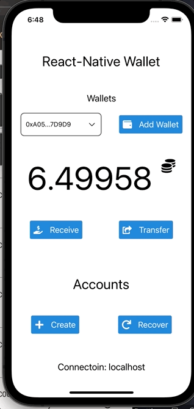

<p align="center">
  <h1 align="center">Simple React-Native Wallet</h1>
  <p align="center">
  
  
  
  
</p>
<br>
<table>
	<tr>
		<th>Create</th>
		<th>Receive</th>
		<th>Recover</th>
		<th>Transfer</th>
 	</tr>
 	<tr>
  		<td>
      
      </td>
  		<td>
      
      </td>
  		<td>


</td>
  		<td>


</td>
 	</tr>
</table>

## Description

Simple react-native wallet connecting to localhost ganache

Developed using:
-EthersJS
-Ganache (Local development)

## Getting Started

First, install dependencies:

```bash
yarn
```

Then, execute ganache and run the app:

```bash
yarn ios
or
yarn android
```
